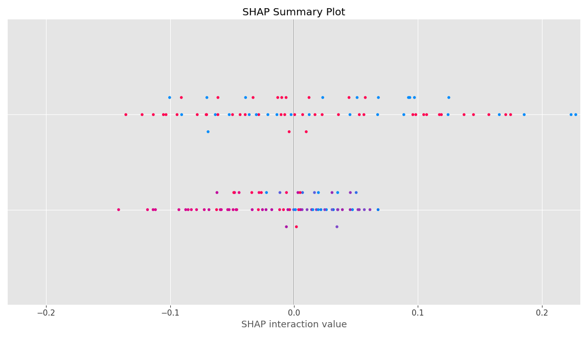
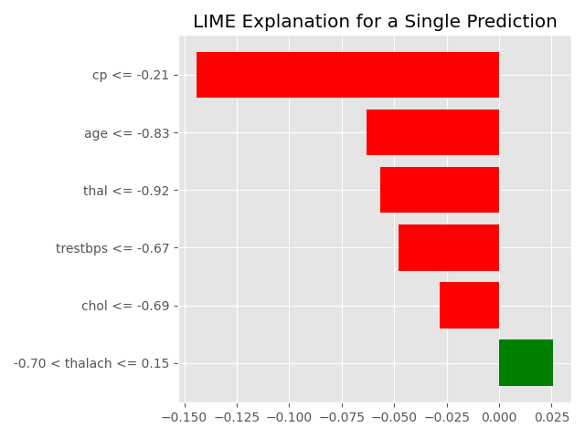
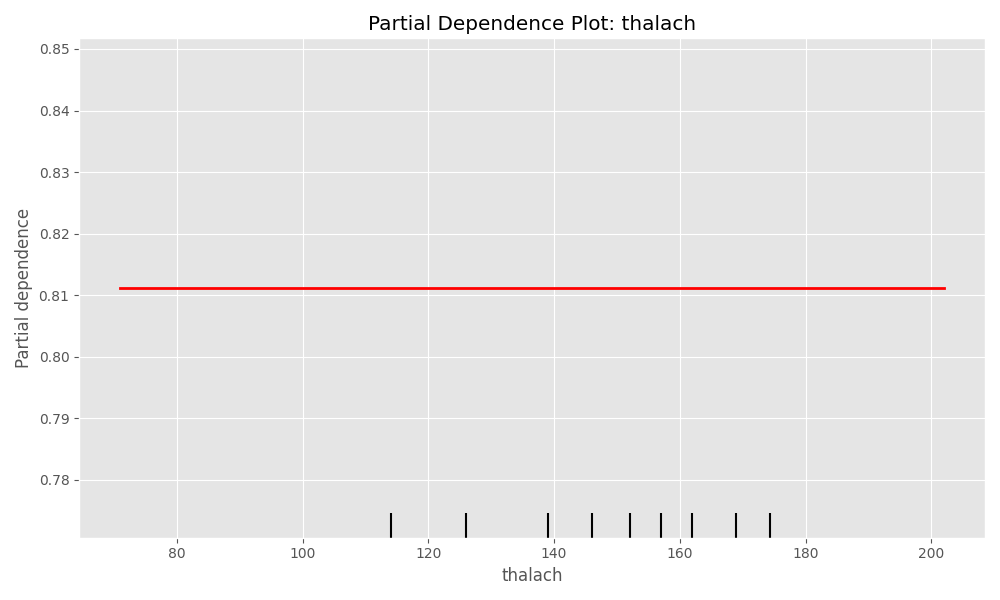

# Heart Disease Prediction with XAI Techniques

## Project Overview

This project demonstrates the application of Explainable AI (XAI) techniques to understand predictions made by a Random Forest classifier on the UCI Heart Disease Dataset. The implementation shows how different XAI methods can provide complementary insights into model behavior and feature importance.

## Dataset

The [UCI Heart Disease Dataset](https://archive.ics.uci.edu/ml/datasets/heart+disease) contains medical attributes that may contribute to heart disease diagnosis, including:

- Demographic information (age, sex)
- Clinical measurements (blood pressure, cholesterol levels)
- Medical test results (ECG, thalassemia)
- The presence or absence of heart disease (target variable)

## Model Performance

- **Algorithm**: Random Forest Classifier
- **Accuracy**: ~85% on test set
- **Top Features**: Maximum heart rate achieved (thalach), number of major vessels (ca), and ST depression induced by exercise (oldpeak)

## Explainable AI Techniques Implemented

### 1. SHAP (SHapley Additive exPlanations)

SHAP values provide a unified measure of feature importance based on game theory concepts. For each prediction, SHAP values indicate how much each feature contributes to pushing the prediction away from the expected value.

**Benefits**:
- Based on game theory with theoretical guarantees
- Shows both global and individual feature effects
- Handles feature interactions

### 2. LIME (Local Interpretable Model-agnostic Explanations)

LIME creates interpretable approximations for individual predictions by perturbing inputs and observing how the model responds around a specific instance.

**Benefits**:
- Easy to understand for individual cases
- Works with any model type
- Intuitive visualizations

### 3. Partial Dependence Plots (PDP)

PDPs show how the model's predictions change as a feature value changes, revealing the shape of the relationship.

**Benefits**:
- Shows overall relationship between feature and outcome
- Visualizes non-linear relationships
- Helps understand feature effects across their ranges

## Implementation Details

The code includes:

1. **Data Processing**:
   - Loads and cleans the Heart Disease Dataset
   - Performs feature scaling and train-test splitting

2. **Model Training**:
   - Implements a Random Forest classifier
   - Evaluates model performance

3. **XAI Implementation**:
   - SHAP analysis with visualizations
   - LIME explanations for individual predictions
   - Partial Dependence Plots for key features

## Conclusions

Combining multiple XAI techniques provides a more comprehensive understanding of model behavior than any single approach. In healthcare applications like heart disease prediction, these explanations can help:

- Clinicians understand model recommendations
- Researchers identify important risk factors
- Patients comprehend their personal risk profile

